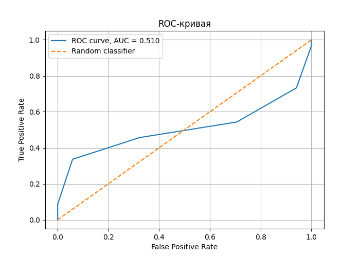
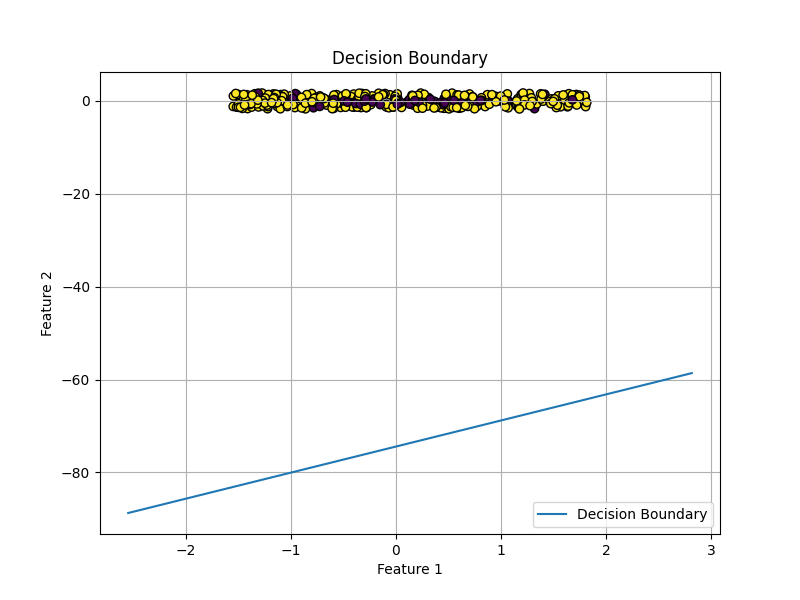
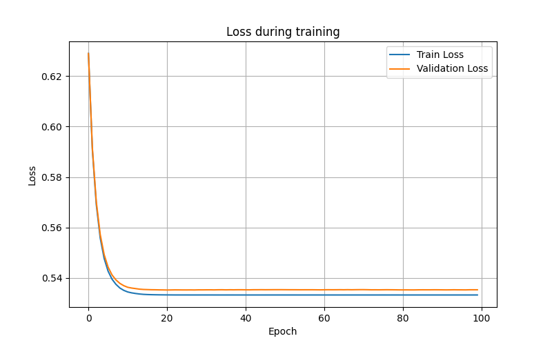
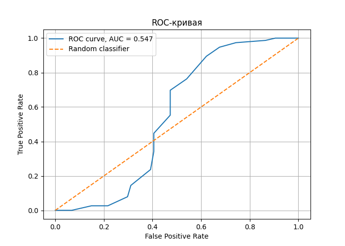
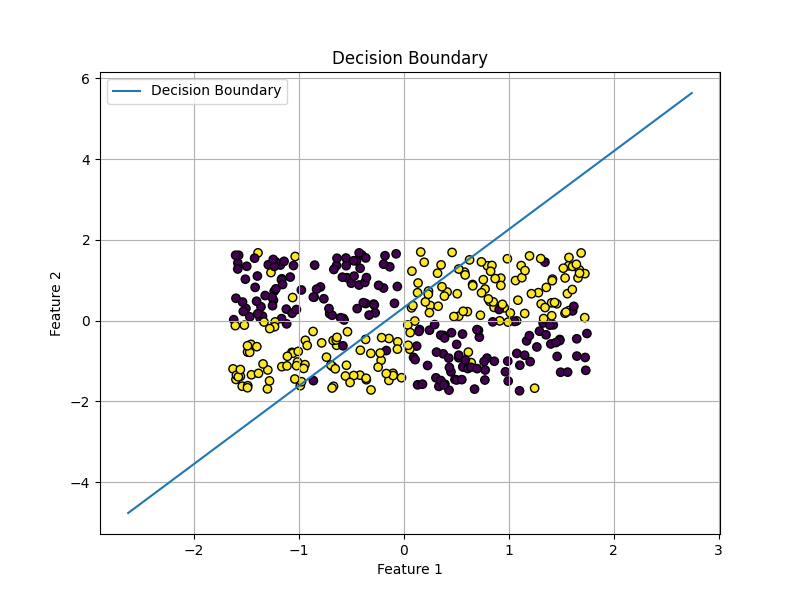
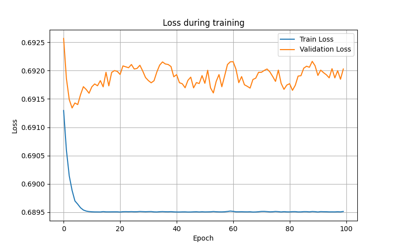
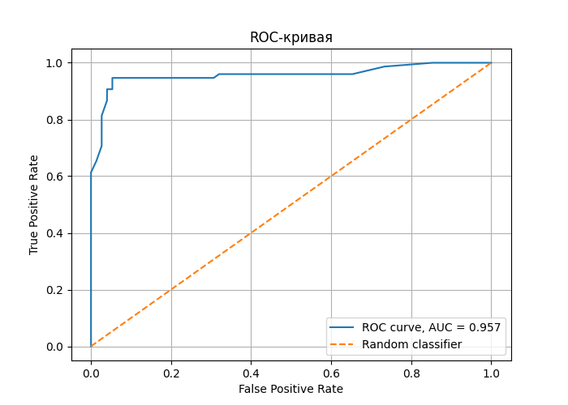
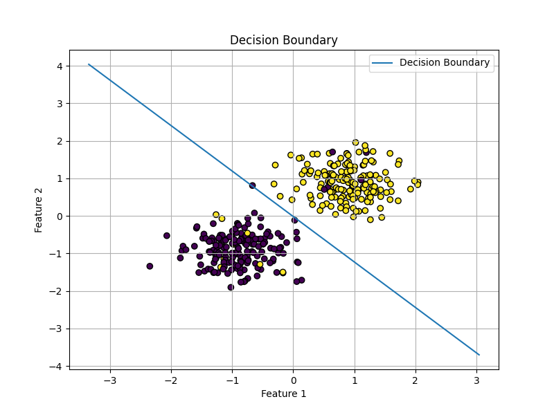
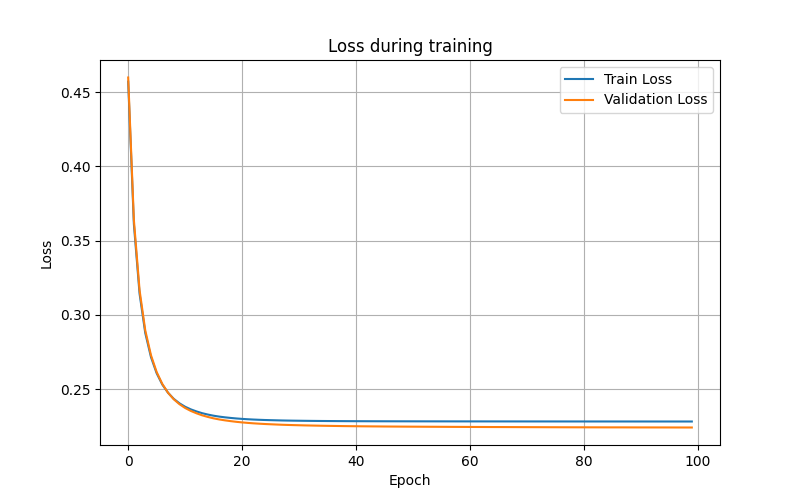

# Однослойный перцептрон: реализация, обучение и анализ

## Цель работы

В работе реализован однослойный перцептрон без использования готовых библиотек глубокого обучения. Проведены эксперименты с различными гиперпараметрами, исследованы ограничения модели и построены графики обучения.

---

# Используемые технологии

- Python
- NumPy
- Matplotlib
- scikit-learn

---

# Структура проекта

```text
.
├── main.py
├── perceptron.py
├── data_utils.py
├── metrics.py
├── experiments.py
├── cross_validation.py
├── utils.py
└── requirements.txt
```

---

# Запуск проекта

```bash
pip install -r requirements.txt
python main.py
```

---

# Теоретическая часть

Линейная модель:

```math
z = w^Tx + b
```

Сигмоидная функция:

```math
\sigma(z)=\frac{1}{1+e^{-z}}
```

Binary Cross-Entropy:

```math
L=-\frac{1}{N}\sum_{i=1}^{N}\left[y_i\log(\hat y_i)+(1-y_i)\log(1-\hat y_i)\right]
```

---

# Результаты базового обучения

| Метрика | Значение |
|---|---|
| Train Accuracy | 0.8657 |
| Test Accuracy | 0.8867 |

## График функции потерь



## Разделяющая граница



## ROC-кривая



---

# Эксперимент: XOR

Однослойный перцептрон не способен корректно решать XOR-задачу, поскольку она не является линейно разделимой.

## График функции потерь



## Разделяющая граница



## ROC-кривая



### Вывод

Для XOR значение accuracy оказалось близким к случайному угадыванию (~0.5), а функция потерь практически не уменьшалась.

---

# Линейно разделимые данные

## График функции потерь



## Разделяющая граница



## ROC-кривая



### Вывод

Для линейно разделимых данных перцептрон успешно обучился и построил корректную разделяющую границу.

---

# Эксперименты с learning rate

Проверялись значения:

- 0.001
- 0.01
- 0.5
- 1.0

## Выводы

- Маленький learning rate приводит к медленной сходимости.
- Большой learning rate вызывает колебания функции потерь.
- Оптимальными оказались значения 0.1–0.5.

---

# Эксперименты с batch size

Проверялись значения:

- 1
- 16
- 64
- 256

## Выводы

- Маленький batch size делает обучение шумным.
- Большой batch size делает обучение стабильнее.
- Batch size = 32 или 64 показал лучшие результаты.

---

# Эксперимент: инициализация весов

Сравнивались:

- нулевая инициализация;
- маленькие случайные веса;
- большие случайные веса.

## Выводы

Большие веса приводят к насыщению sigmoid-функции и ухудшению обучения.

Наилучшие результаты показала инициализация маленькими случайными значениями.

---

# Дополнительные метрики

Реализованы:

- Accuracy
- Precision
- Recall
- F1-score
- ROC-AUC
- ROC-кривая

---

# Кросс-валидация

Реализована 5-кратная кросс-валидация для подбора:

- learning rate;
- batch size.

---

# Заключение

В ходе лабораторной работы был реализован однослойный перцептрон с нуля.

Были исследованы:

- влияние learning rate;
- влияние batch size;
- влияние инициализации весов;
- ограничения однослойного перцептрона.

Эксперименты показали, что модель хорошо работает только для линейно разделимых данных.

Для более сложных задач необходимы многослойные нейронные сети.

